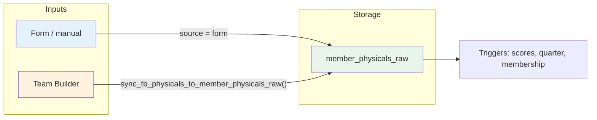
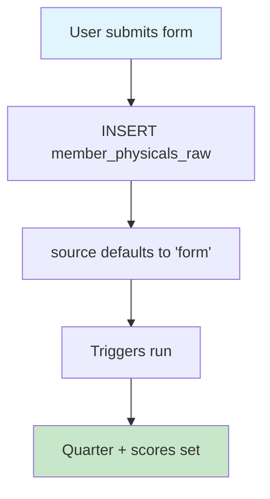
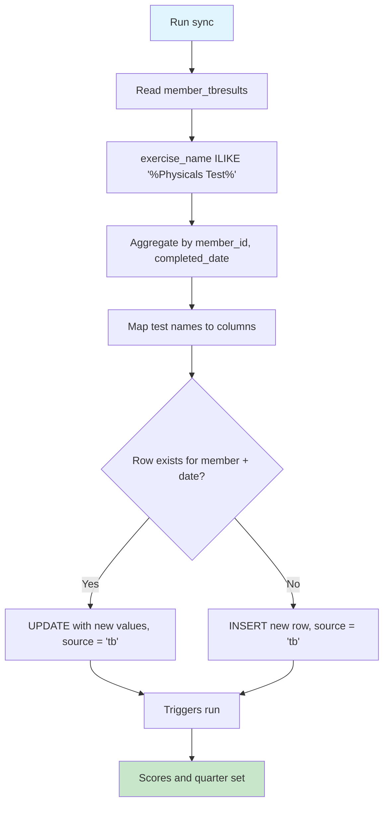
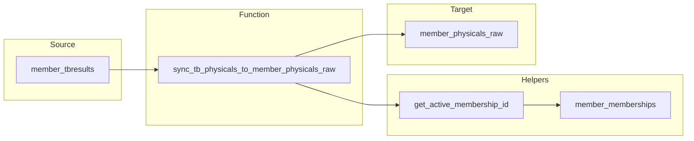
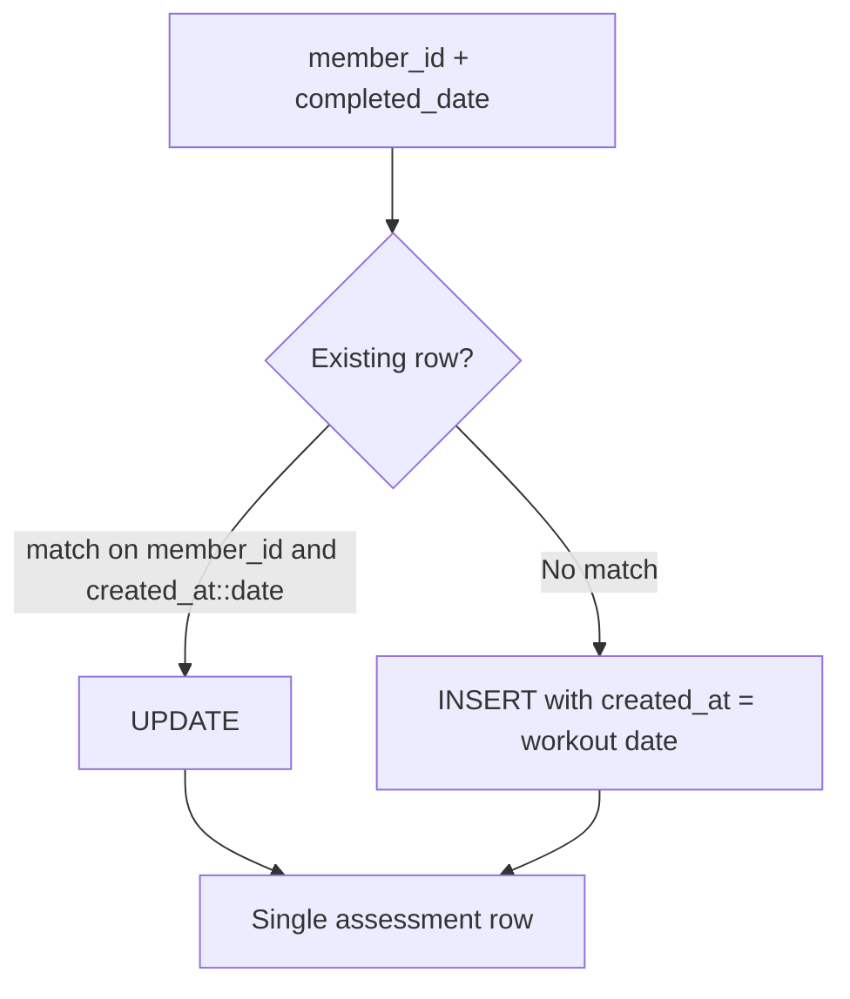

# Process & functions

How physicals assessments get into the system and how the main functions and tables fit together.

---

## Assessment sources

Assessments in *member_physicals_raw* come from two places:

| Source | When | *source* value |
|--------|------|----------------|
| **Form** | Manual entry (UI / import) | `form` (default) |
| **Team Builder** | Sync from workout results | `tb` |

*Table: *member_physicals_raw*. Column: *source* (text).*

---

## High-level flow

*Inserts into *member_physicals_raw* fire *auto_populate_membership_id* and *auto_calculate_physicals_scores* (scores, age, quarter).*

---

## Form path (manual entry)

*No extra logic; *source* stays `form`.*

---

## Team Builder sync path

*Function: *sync_tb_physicals_to_member_physicals_raw()*. Reads from *member_tbresults*; writes to *member_physicals_raw* with *source* = `tb`.*

---

## Sync function: data flow

*Sync uses *get_active_membership_id(member_id, completed_date)* and *member_memberships.coach_id* for membership and coach.*

---

## Sync: test name → column (summary)

| Name contains (ILIKE) | Column written |
|------------------------|----------------|
| push up / push-up | *push_ups_value* |
| vertical jump | *vertical_jump_value* |
| chin hold | *chin_hold_value* |
| grip + left/right | *grip_strength_left* / *grip_strength_right* |
| grip (no side) | *grip_strength_value* |
| lateral hop + left/right | *left_lateral_hop* / *right_lateral_hop* |
| vo2 | *vo2_value* |
| rsi | *rsi_value* |
| concept2 | *concept2_value* |

*Only rows with “Physicals Test” in *exercise_name* are synced. Values from *reps* or *result* depending on test.*

---

## One row per member per date

*Sync keeps one *member_physicals_raw* row per member per workout date; later syncs update that row.*

---

## Key tables & functions

| Item | Role |
|------|------|
| *member_physicals_raw* | All assessments; *source* = `form` or `tb`. |
| *member_tbresults* | Team Builder exercise results; source for TB sync. |
| *member_memberships* | Active membership and *coach_id* for sync. |
| *sync_tb_physicals_to_member_physicals_raw()* | Syncs Physicals Test rows into *member_physicals_raw*; sets *source* = `tb`. |
| *get_active_membership_id(member_id, date)* | Returns active membership for that date. |
| *auto_calculate_physicals_scores* | Trigger: age, quarter, scores from *physicals_scoring_lookup*. |
| *auto_populate_membership_id* | Trigger: fills *membership_id* if NULL on insert. |

*Run *sync_tb_physicals_to_member_physicals_raw()* on a schedule or on-demand to pull new TB physicals.*
