# Quarterly Physicals Reporting System

A comprehensive quarterly reporting cycle system for physical assessments with automatic quarter assignment, scoring, and reporting capabilities.

## System Overview


## Data Flow Architecture

```mermaid
flowchart LR
    subgraph Input["📥 Input Sources"]
        Manual[Manual Entry]
        Import[CSV Import]
        API[API/Form]
    end
    
    subgraph Processing["⚙️ Processing Layer"]
        Trigger[Auto Calculate Trigger]
        QuarterFunc[Quarter Assignment]
        ScoreFunc[Score Calculation]
    end
    
    subgraph Storage["💾 Database Tables"]
        Raw[member_physicals_raw]
        Cycles[physicals_quarterly_cycles]
        Lookup[physicals_scoring_lookup]
        Members[member_database]
    end
    
    subgraph Output["📊 Output & Reporting"]
        Summary[view_physicals_quarterly_summary]
        Due[view_members_due_for_assessment]
        Rollup[Rollup Functions]
    end
    
    Input --> Processing
    Processing --> Storage
    Storage --> Output
    
    style Input fill:#e3f2fd
    style Processing fill:#fff3e0
    style Storage fill:#f3e5f5
    style Output fill:#e8f5e9
```



## Quarterly Cycle Assignment Flow


## Database Schema Relationships


## Assessment Processing Pipeline


## Quarterly Reporting Flow


## Yearly Cycle Generation


## Score Calculation Flow


## Key Features

- ✅ **Automatic Quarter Assignment**: Assessments automatically assigned to closest quarterly cycle
- ✅ **Smart Defaults**: Submission date defaults to last assessment if not provided
- ✅ **Auto-Scoring**: All test scores calculated automatically from lookup tables
- ✅ **Most Recent Only**: Reporting uses most recent assessment per member per quarter
- ✅ **Yearly Automation**: Cycles auto-generated for following year via cron job
- ✅ **Monday Adjustment**: Cycle dates automatically adjusted to closest Monday

## Database Tables

| Table | Purpose |
|-------|---------|
| `member_physicals_raw` | Stores all physical assessments with values and scores |
| `physicals_quarterly_cycles` | Defines quarterly cycle dates and metadata |
| `physicals_scoring_lookup` | Lookup table for converting raw values to scores (0-10) |
| `member_database` | Member information (DOB, gender, etc.) |

## Views & Functions

| Component | Purpose |
|-----------|---------|
| `view_physicals_quarterly_summary` | Quarterly summary with most recent assessments |
| `view_members_due_for_assessment` | Active members needing assessments |
| `get_quarterly_rollup()` | Get detailed rollup for member/quarter |
| `get_cycle_completion_status()` | Get completion statistics for a cycle |

## Usage

### Create Assessment
```sql
INSERT INTO member_physicals_raw (member_id, submission_date, grip_strength_value, ...)
VALUES (...);
-- Quarter and scores automatically assigned!
```

### View Quarterly Summary
```sql
SELECT * FROM view_physicals_quarterly_summary 
WHERE cycle_year = 2026 AND quarter_number = 1;
```

### Get Members Due
```sql
SELECT * FROM view_members_due_for_assessment;
```

## Quarterly Cycles (2026)

- **Q1**: March 9, 2026 - Post-New Year execution phase
- **Q2**: June 13, 2026 - Financial + physical accountability (EOFY)
- **Q3**: September 7, 2026 - Post-winter slump reset
- **Q4**: December 7, 2026 - Q4 Assessment Cycle

## Automation

- **Cron Job**: Runs annually on December 1st to generate next year's cycles
- **Trigger**: Auto-calculates scores and assigns quarters on insert/update
- **Default Dates**: Automatically uses last assessment date if not provided

