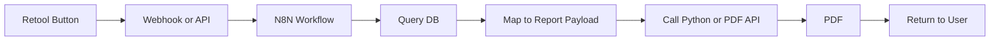

# Physical Report PDF — Automation Plan

This document maps out how to automate generation of the Lockeroom Physical Report PDF from a Retool UI trigger, via N8N, using data from the physicals database. It also scopes custom graphs (e.g. radar) and trends over time.

---

## 1. High-level flow (Retool → N8N → PDF)

**Trigger:** A button click in Retool for a specific member (and optionally a specific assessment or quarter).

**Steps:**

1. **Extract** — Retool or N8N reads the relevant data. Sources are the same Supabase/Postgres used by the physicals system: `member_database`, `member_physicals_raw`, `view_physicals_quarterly_summary`, `get_quarterly_rollup()`, and optionally `physicals_scoring_lookup` for stage bands/labels. Alternatively, Retool sends a member ID (and optionally cycle/date) to N8N; N8N then queries the database and builds the payload.

2. **Map** — Transform database rows into the report payload expected by `generate_html_pdf.py`. The exact shape is defined by `get_dummy_data()` in that script: `name`, `dob`, `assessor`, `date`, `report_date`, `category`, `health_score`, `fitness_score`, `strength_score`, stage numbers (1–4), `result_groups` (per pillar, with per-test `result`, `active` stage, and `s1`–`s4` range strings), plus `stages` (journey copy), `vo2_ranges`, and asset placeholders.

3. **Generate** — Run the Python PDF generator with that payload, either via CLI (e.g. N8N “Execute Command”) or a small HTTP API (e.g. FastAPI) that accepts JSON and returns the PDF binary.

4. **Deliver** — Return the PDF to the user: e.g. download link, email attachment, or store in blob storage and link from Retool.

---

## 2. Data mapping (what to extract and where it goes)

| Report field / group | Likely source | Notes |
|----------------------|---------------|--------|
| `name`, `dob` | `member_database` | Format DOB for display (e.g. `DD. MM. YYYY`). |
| `assessor` | `staff_database` (or coach on assessment) | Join via `coach_id` on `member_physicals_raw` if stored there. |
| `date`, `report_date` | Assessment row or `physicals_quarterly_cycles` | `report_date` is often “today” for generation; `date` is assessment/cycle date. |
| `next_physical` | Config or derived (e.g. “4–6 Months” from cycle). | May be fixed copy or from membership/reminder logic. |
| `category` | Derived from member | e.g. “Female, Ages 40 & Under” from DOB + gender. |
| `health_score`, `fitness_score`, `strength_score` | Views / rollup | Precomputed 0–10 scores; see repo README — scores live in `member_physicals_raw` or views. |
| `health_stage`, `fitness_stage`, `strength_stage` | Derived from scores | Map 0–5.9 → 1, 6–7.9 → 2, 8–9.9 → 3, 10+ → 4 (or use `physicals_scoring_lookup` if bands differ per test). |
| `body_fat`, `inbody_points`, `vo2_max`, etc. | `member_physicals_raw` or rollup | Raw test values; use view fallback (e.g. previous cycle) when missing. |
| `result_groups` | Same + lookup | Each test: `name`, `result`, `active` (1–4), and `s1`–`s4` range strings for table; ranges can come from `physicals_scoring_lookup` or a shared config. |
| `stages` | Static copy | Journey text (Reset, Baseline, Longevity, Performance) can be fixed in mapping or in template. |
| `logo_b64`, `hero_b64` | Assets | Currently loaded from `reporting/assets` (logo.png, hero.png). Automation can keep the same files or pass URLs/base64 if different per client. |

The report expects **precomputed scores** (0–10) and **stage numbers** (1–4). The mapping layer must either use the stored scores and derive stage from the standard bands above, or use `physicals_scoring_lookup` (or equivalent) when stage bands are needed for display in the results table.

---

## 3. Potential complications and issues

- **Missing or null tests** — The template supports N/A for tests. The mapping must supply sensible defaults and handle missing rows (e.g. use fallback to previous cycle as in existing views).

- **Stage derivation** — Mapping from raw scores to stage 1–4 must match the report’s stage bands. Use a single source of truth (e.g. lookup table or shared function) so the table’s “Stage 1–4” columns and the summary badges stay consistent.

- **Assessor and dates** — Clarify where assessor name and “next physical” come from (e.g. from the assessment record, staff table, or separate config).

- **Running Python from N8N** — Options: (1) Execute Command node if Python and dependencies (Playwright, Jinja2, etc.) run on the same host as N8N; (2) a small REST service (e.g. FastAPI) that accepts JSON and returns PDF. The latter is recommended for portability, error handling, and scaling.

- **Timeouts and concurrency** — PDF generation can take several seconds. Webhook or Retool timeouts may need to be increased, or the job run asynchronously (e.g. N8N queue, or Retool “run in background” and poll/link when ready).

- **Idempotency and filenames** — The current script uses member name + date in the filename. For automation, including member ID or assessment ID in the path helps avoid overwrites and supports “regenerate” flows.

---

## 4. Custom graphs (e.g. radar chart)

**Feasibility:** Yes.

**Options:**

- **Server-side (Python)** — Generate a radar (or other) chart with matplotlib or plotly, save as PNG, base64-encode, and pass into the Jinja template as an extra variable (e.g. `radar_chart_b64`). Add a block in the template that displays this image.

- **Client-side (HTML/JS)** — Add a charting library (e.g. Chart.js) in the template, pass chart data as JSON into the page, and render the chart in the browser before Playwright runs `page.pdf()`. With `print_background=True`, the canvas is included in the PDF.

**Data** — A radar chart could plot Health, Fitness, Strength, and optionally submetrics (e.g. VO2, push-up, vertical jump) from the same payload used for the report. One chart per report is enough for v1.

**Scope** — Start with one radar (e.g. “Pillar scores” or “Key metrics”) and one template slot; treat trends over time separately (see below).

---

## 5. Trends over time

**Data** — Requires multiple assessments per member. The repo already has `member_physicals_raw` with `submission_date` and quarter cycles; views/rollups can provide “last N assessments” or “by quarter” for a member.

**What to show** — For example: line or bar charts of `health_score`, `fitness_score`, `strength_score` (and optionally key raw metrics) by date or quarter.

**Implementation** — Same as custom graphs: (1) Python generates trend chart image(s) and injects into the template, or (2) JS in the template draws the chart from JSON; then the existing PDF pipeline runs as now.

**Scope** — Trends are a natural follow-on after “single assessment PDF” and “radar” are solid. Define clearly which dates/cycles to include and a maximum number of points per chart to keep the report readable.

---

## 6. Phasing / scope summary

| Phase | Scope |
|-------|--------|
| **Phase 1** | Retool button → N8N (or direct API) → fetch member + one assessment → map to current report payload → run `generate_html_pdf.py` → return PDF. No new graphs. |
| **Phase 2** | Add one radar (or similar) chart to the report using the same payload; implement via Python image or JS in template. |
| **Phase 3** | Add historical data fetch and trend chart(s); optional extra page or section in the same PDF. |

---

## References

- Report generator and payload shape: [generate_html_pdf.py](generate_html_pdf.py) (`get_dummy_data()`).
- Template: [template.html](template.html).
- Physicals data model and views: repo [README.md](../README.md) and [Process_and_functions.md](../Process_and_functions.md).
